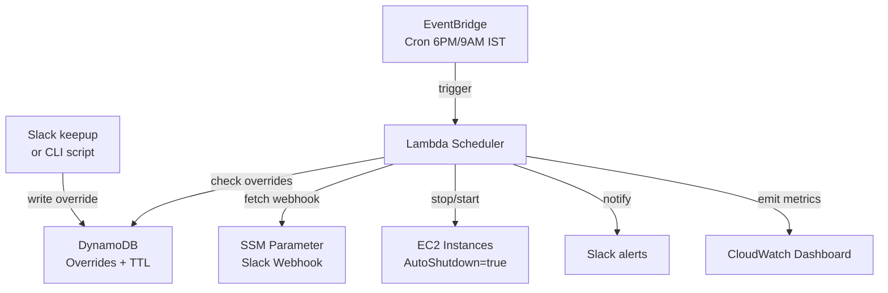

# AWS FinOps Auto-Shutdown System 💰

> Automated cost optimization for non-production AWS environments.
> Reduces dev/staging cloud costs by ~65% via tag-based resource scheduling.


## The Problem

Most companies leave dev/staging AWS environments running 24×7 (168 hrs/week)
even though developers actively use them only ~45 hrs/week. **The remaining 73% is pure waste.**
For a typical 100-instance non-prod fleet, this can add up to ₹3–5 lakhs/month in unnecessary AWS spend.

## The Solution

A serverless scheduler that:
- Automatically **stops** tagged dev/staging resources after office hours (6 PM IST)
- Automatically **starts** them before work hours (9 AM IST)
- Lets developers request **temporary overrides** when working late (via CLI; Slack `/keepup` planned)
- Sends **daily cost summaries** to Slack with savings tracking
- Visualizes savings on a **CloudWatch dashboard**

## Architecture



The system uses **tag-based discovery** — no central registry to maintain.
Any EC2 instance tagged `AutoShutdown=true` becomes managed.

## Tech Stack & Decisions

| Layer | Technology | Why |
|-------|-----------|-----|
| IaC | Terraform 1.5+ | Industry standard, declarative |
| Compute | AWS Lambda (Python 3.11) | Serverless, pay-per-invoke, scales to zero |
| Scheduling | EventBridge cron | Native AWS, zero ops overhead |
| State | DynamoDB (on-demand) | TTL for auto-cleanup, free-tier friendly |
| Secrets | SSM Parameter Store (SecureString) | KMS-encrypted, free, audit-logged |
| Notifications | Slack Incoming Webhooks | Standard integration |
| Observability | CloudWatch Metrics + Dashboard | AWS-native, Grafana-compatible |

## Tagging Strategy

| Tag Key | Value | Purpose |
|---------|-------|---------|
| `AutoShutdown` | `true` | Mark resource as managed |
| `Environment` | `dev` / `staging` | Scope filter (never touch prod) |
| `Schedule` | `weekday-9-18` | Document expected uptime |

## Override Mechanism

Developer working late? Request a temporary skip:

```bash
./scripts/request_override.sh i-0abc123 4
# Valid for 4 hours, auto-expires via DynamoDB TTL
```


## Cost Savings Methodology

Per t3.micro instance per night:

For a **50-instance dev fleet**: ~₹650/night → **~₹14,000/month → ~₹1.7 lakh/year**.

## Engineering Decisions (Trade-offs)

### Why Lambda over Fargate?
Event-driven workload runs ~10×/day for <1s. Lambda has zero idle cost; Fargate would idle and cost more.

### Why DynamoDB over RDS for overrides?
- **TTL native** — expired overrides auto-delete
- **Pay-per-request** — ₹0 when idle
- Single-key access — relational features unnecessary

### Why SSM Parameter Store over Secrets Manager?
- **Free** (Secrets Manager: $0.40/secret/month adds up)
- Same KMS-backed encryption
- Secrets Manager wins for auto-rotation, which webhook URLs don't need

### Why fail-open on DynamoDB errors?
If override check fails, we proceed with action rather than blocking.
Scheduler reliability > override convenience — an outage in override service
shouldn't prevent cost-saving actions.

### Idempotency
AWS `stop_instances` / `start_instances` are idempotent — running twice has no
extra effect. This lets the scheduler safely retry on partial failures.

## Repository Layout
.
├── terraform/                 # Infrastructure as Code
│   ├── providers.tf           # AWS provider, default tags
│   ├── playground.tf          # Test EC2 instances
│   ├── lambda.tf              # Scheduler function
│   ├── iam.tf                 # Roles + base policies
│   ├── eventbridge.tf         # Cron schedules
│   ├── dynamodb.tf            # Override table
│   ├── secrets.tf             # SSM webhook parameter
│   └── cloudwatch.tf          # Metrics + dashboard
├── lambdas/scheduler/
│   └── handler.py             # Core scheduler logic
├── scripts/
│   └── request_override.sh    # Developer override CLI
├── tests/                     # Unit tests with moto
├── .github/workflows/         # CI/CD pipelines
└── docs/
├── milestones.md
└── interview-talking-points.md

## Getting Started

```bash
# 1. Configure AWS CLI
aws configure

# 2. Configure secrets
cp terraform/terraform.tfvars.example terraform/terraform.tfvars
# Edit terraform.tfvars with your Slack webhook URL

# 3. Deploy
cd terraform
terraform init
terraform apply
```

## Roadmap

- [ ] Slack slash command (`/keepup`) — replace CLI
- [ ] Multi-region support
- [ ] RDS, EKS nodegroups, ASG support
- [ ] Holidays calendar integration
- [ ] Per-team cost attribution

## License

MIT
